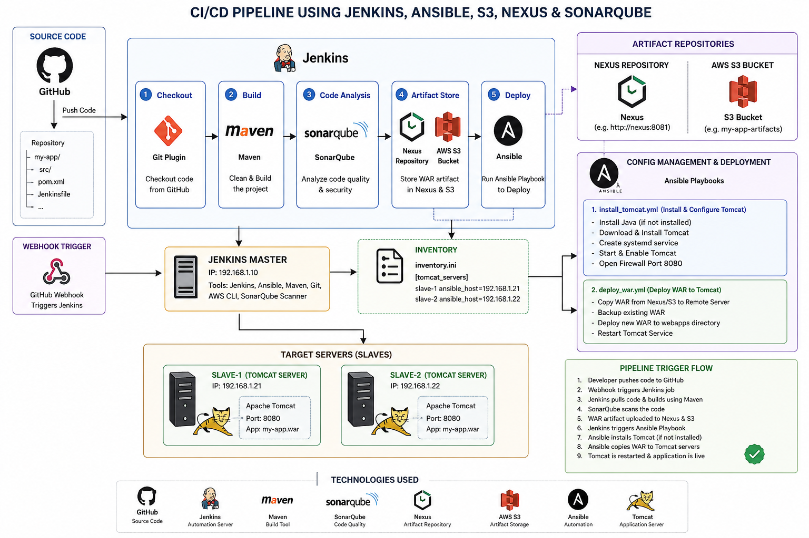

# 🚀 End-to-End CI/CD Pipeline Using Jenkins, Ansible, SonarQube, Nexus, AWS S3 & Apache Tomcat

## 📌 Project Overview

This project demonstrates an **end-to-end Continuous Integration and Continuous Deployment (CI/CD) pipeline** that automates the complete software delivery process.

Whenever a developer pushes code to GitHub, Jenkins automatically starts the pipeline, builds the application using Maven, performs code quality analysis with SonarQube, stores the generated WAR artifact in Nexus Repository and AWS S3, and finally deploys the application to a remote Apache Tomcat server using Ansible.

The deployment is fully automated and requires no manual intervention.

---

# 🏗️ CI/CD Architecture

<p align="center">
  
</p>

---

# 🔄 Complete Pipeline Workflow

```
Developer
    │
    ▼
GitHub Repository
    │
    │ Git Push
    ▼
GitHub Webhook
    │
    ▼
Jenkins Pipeline
    │
    ├──────────────► Checkout Source Code
    │
    ├──────────────► Maven Build
    │
    ├──────────────► SonarQube Code Analysis
    │
    ├──────────────► Generate WAR File
    │
    ├──────────────► Upload WAR to Nexus Repository
    │
    ├──────────────► Backup WAR to AWS S3
    │
    ├──────────────► Execute Ansible Playbook
    │                         │
    │                         ▼
    │            Install & Configure Apache Tomcat
    │
    ├──────────────► Execute Deploy Playbook
    │                         │
    │                         ▼
    │            Copy WAR to Remote Tomcat Server
    │
    ├──────────────► Restart Tomcat
    │
    ▼
Application Successfully Deployed
```

---

# ⚙️ Pipeline Stages

### 1️⃣ Source Code Management

- Developer pushes source code to GitHub.
- GitHub Webhook automatically triggers Jenkins.

---

### 2️⃣ Continuous Integration

Jenkins performs the following tasks:

- Pulls the latest source code
- Builds the application using Maven
- Generates the WAR package

---

### 3️⃣ Static Code Analysis

SonarQube scans the source code and checks:

- Bugs
- Vulnerabilities
- Code Smells
- Maintainability
- Security Issues
- Quality Gate Status

---

### 4️⃣ Artifact Management

After a successful build:

- WAR file is uploaded to Nexus Repository
- WAR file is backed up to AWS S3

This provides secure artifact storage and version management.

---

### 5️⃣ Infrastructure Automation

Jenkins executes the first Ansible Playbook.

The playbook automatically:

- Installs Java
- Downloads Apache Tomcat
- Installs Tomcat
- Creates Tomcat Service
- Configures Tomcat
- Starts Tomcat
- Enables Tomcat Service

If Tomcat is already installed, Ansible skips unnecessary tasks.

---

### 6️⃣ Automated Deployment

A second Ansible Playbook performs deployment.

It automatically:

- Copies the latest WAR file
- Deploys WAR into Tomcat webapps directory
- Restarts Apache Tomcat
- Makes the application live

No manual deployment is required.

---

# 🛠️ Technologies Used

| Category | Technology |
|----------|------------|
| Source Code | GitHub |
| CI Server | Jenkins |
| Build Tool | Maven |
| Code Quality | SonarQube |
| Artifact Repository | Nexus Repository |
| Cloud Storage | AWS S3 |
| Automation | Ansible |
| Application Server | Apache Tomcat |
| Operating System | Linux |
| Language | Java |

---

# 📋 Prerequisites

- Git
- GitHub Repository
- Jenkins
- Maven
- Java
- SonarQube
- Nexus Repository
- AWS CLI
- AWS S3 Bucket
- Ansible
- Apache Tomcat
- Linux Servers
- SSH Key Authentication

---

# 🚀 Deployment Process

1. Developer pushes code to GitHub.
2. GitHub Webhook triggers Jenkins.
3. Jenkins checks out the source code.
4. Maven builds the project.
5. SonarQube analyzes code quality.
6. WAR file is generated.
7. WAR file is uploaded to Nexus Repository.
8. WAR file is backed up to AWS S3.
9. Jenkins executes the Tomcat installation Ansible playbook.
10. Jenkins executes the deployment playbook.
11. WAR file is copied to the remote Tomcat server.
12. Apache Tomcat restarts automatically.
13. The application is successfully deployed.

---

# ✨ Key Features

✅ Automated CI/CD Pipeline

✅ GitHub Webhook Integration

✅ Jenkins Declarative Pipeline

✅ Maven Build Automation

✅ SonarQube Code Quality Analysis

✅ Nexus Artifact Management

✅ AWS S3 Artifact Backup

✅ Ansible Configuration Management

✅ Automated Apache Tomcat Installation

✅ Automated WAR Deployment

✅ Zero Manual Deployment

---

# 📈 Benefits

- Fully Automated Deployment
- Faster Software Delivery
- Consistent Deployments
- Reduced Human Errors
- Infrastructure as Code (IaC)
- Easy Rollback Using Stored Artifacts
- Better Code Quality
- Scalable Deployment Process

---

# 📸 Screenshots

- Jenkins Pipeline
- SonarQube Dashboard
- Nexus Repository
- AWS S3 Bucket
- Apache Tomcat
- Application Running
- CI/CD Architecture Diagram

---

# 👨‍💻 Author

**Charan Vardhan**

DevOps Engineer | AWS | Jenkins | Docker | Kubernetes | Ansible | Terraform | Maven | SonarQube | Nexus | Linux | GitHub | CI/CD
